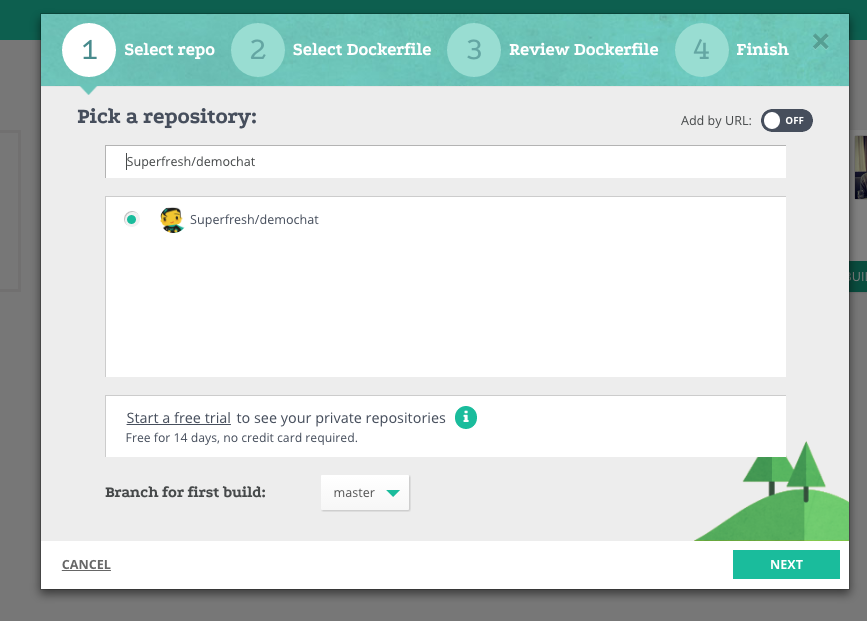
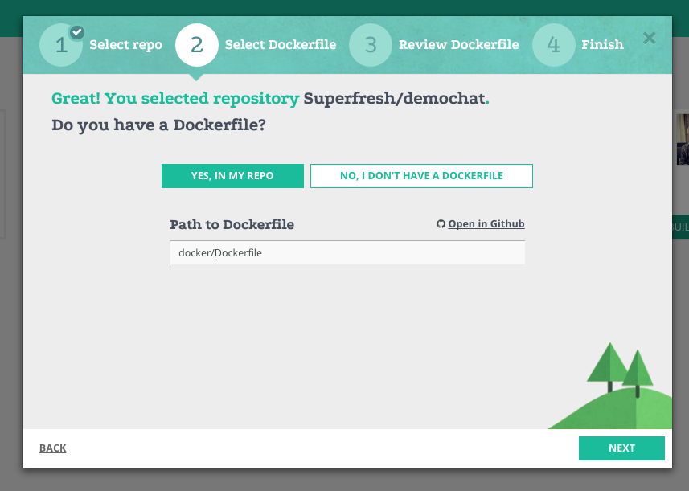
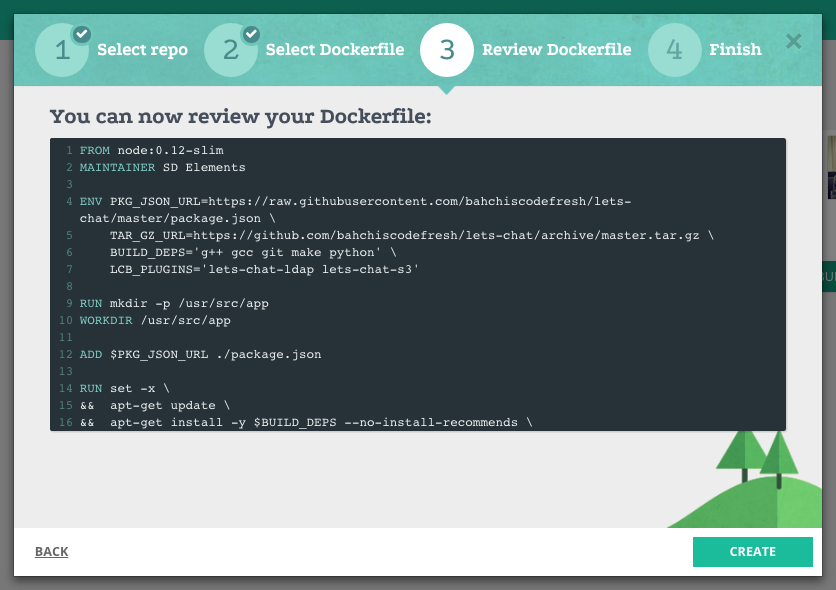

Use this tutorial to familiarize yourself with codefresh.yml file and codefresh functionality.


This tutorial is based on let’s chat [app].

https://github.com/codefreshdemo/demochat

###Let’s chat is self-hosted chat app for small teams or big Gal by Security Compass.

This tutorial will walk adding the following :

* setup-step. Freestyle type step ,setup step

* Build-step, Build type step - that will build docker image for your let’s chat app

* Push to registry ,Push type step - that will push your image to docker hub

* after-build. Freestyle type step ,runs after the build

* Composition-step. Composition type step will run composition which use your chat image from the build-step, doker image of curl 
and print works if curl to our app at port 5000 succeed 

So the first thing you need to do is :

##Fork our repo
Enter the following link and fork let’s chat app


##Add a service
Now enter Codefresh and add your let’s chat app


press on 'Add New Service'



choose your repo and press next


enter the path of your docker file (docker/Dockerfile)


press on create

Done !


##Build your image
Create a codefresh.yml file in this structure

```
version: '1.0'
steps:

 build-step:
     type: build
     dockerfile: docker/Dockerfile
     image-name: verchol/lets-chat
     tag: codefresh
 ```
Under dockerfile add your docker file location
Image-name will be the name of your image (important for the push step)
Tag will be the tag of the image

After you finished ,add the codefresh.yml file to your repository.

##Choose your codefresh.yml
Go to your service in codefresh and choose the codefresh.yml file 


And run the build for first time !

##Push your image to docker
First configure your account’s Docker registry details and credentials 
under account management

Now add the following step to your codefresh.yml file
```
push to registry:
     type: push
     candidate: ${{build-step}}
     tag: ${{CF_BRANCH}}
```

You can read about 
${{build-step}} and ${{CF_BRANCH}} are codefresh vars which you can use.
${{build-step}} - will take the image from the build-step
${{CF_BRANCH}} will use the branch that the builds runs on

Make sure you gave the image a name that you are able to push to docker hub 


##Unit test your image
add the following step to your codefresh.yml file
```
unit-tests:
      image: ${{build-step}}
      fail-fast: false
      working-directory : ${{initial-clone}}
      commands:
        - npm test
        - echo $(date)
```        
${{initial-clone}} is also a codefresh var , it contains the path and files taken from your initial clone step .


##Add composition step
add the following step to your codefresh.yml file
```
composition-step:
      type: composition
      composition: demo-chat-e2e
      composition-candidates:
        main:
          image: nhoag/curl
          command: bash -c "sleep 20 && curl http://app:5000/" | echo 'works'
```


and that's it !


[app]: https://github.com/containers101/demochat
