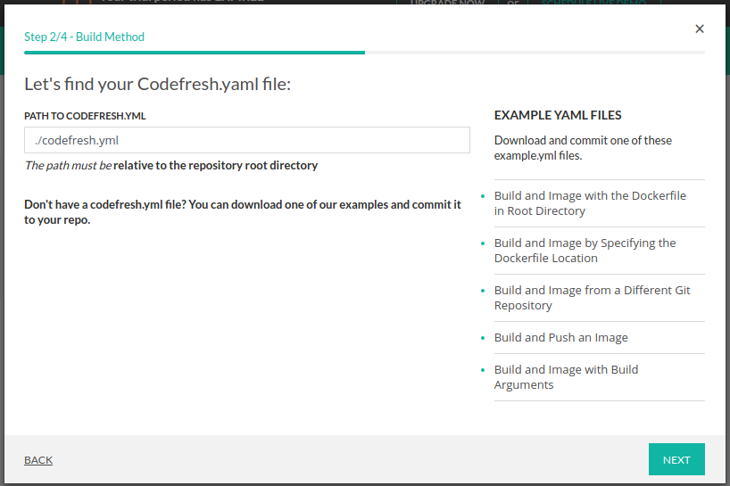
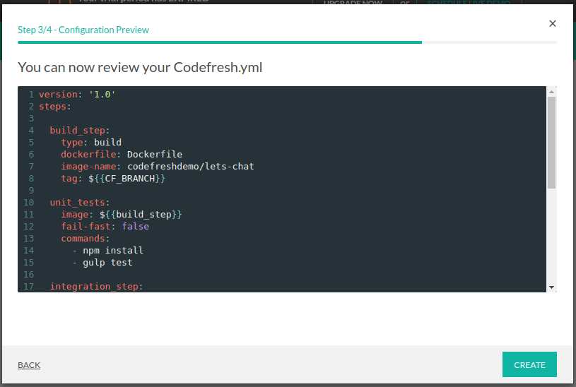
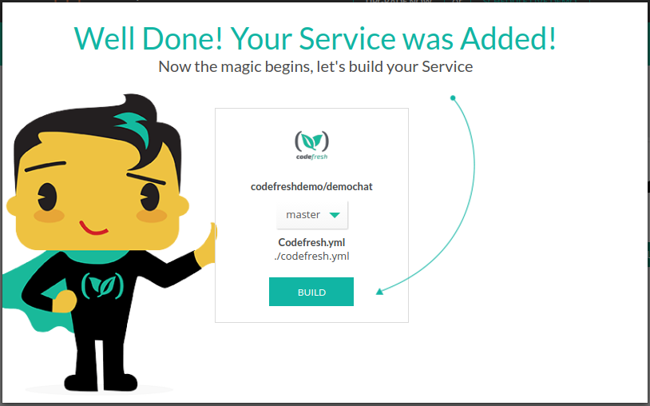

Demo!
Use this tutorial to familiarize yourself with codefresh.yml file and codefresh functionality.


###Let’s chat is self-hosted chat app for small teams or big

This tutorial will walk you through the process of adding the following :


* Build step - that will build docker image for your let’s chat app

* Push to registry step - that will push your image to docker hub

* Unit Test step - A freestyle step that runs the unit test of the demo chat after the build

* Composition step - This step will run a composition which use your chat image from the build step, docker image of curl
and check if your application is responsive. It will do so by printing "works" if a curl command to our app at port 5000 succeed.

So the first thing you need to do is :

##Fork our repo
![Doron & Oleg]
Enter the following link https://github.com/codefreshdemo/demochat and fork let’s chat app


* [Getting started with Docker](#docker)
* [Getting started with DockerCompose](#docker_compose)
* [Getting started with Codefresh YAML](#codefresh_yml)

<a name="docker"/>
#Getting started with Docker

##Add a repository
Now enter Codefresh and add your let’s chat app as a codefresh service.

press on ___Add Repository___

now add you forked demochat repo.
toggle to ___Add by URL___


enter the forked repo url

and choose the branch for your first build (in this case ```master```)


when you finish press ___next___.


select the build method Dockerfile


enter the path of your docker file (in our case it's simply ```Dockerfile```)
and press ___next___


make sure you can see the preview of your dockerfile
and press ___create___


pressing on ___build___  button will trigger a regular build


great , you  are running  your build for the first time !


in order to see the list of you current services press on the ___services___ button


and see your new service


<a name="docker_compose"/>
#Getting started with DockerCompose

Go to the tab "Compositions" and press on the button __ADD COMPOSITION__


In the **Composition Name** text box, type a name for your composition and click __NEXT__


Select Composition Starting Point. On this screen you can choose: __What type of composition would you like to create?__
Select the **File in repo** and click **NEXT**.


Enter the path https://github.com/codefreshdemo/demochat, choose the branch "master" and click **NEXT**.


Enter the path of your docker-compose.yml file (in our case it's simply ```docker-compose-build.yml```) and press ___NEXT___


Then click on the **CREATE**.


Click on the button __BUILD IMAGES__


<a name="codefresh_yml"/>
#Getting started with Codefresh YAML

##Add a service
Now enter Codefresh and add your let’s chat app as a codefresh service.

press on ___Add Repository___

now add you forked demochat repo.
toggle to ___Add by URL___


enter the forked repo url

and choose the branch for your first build (in this case ```master```)


when you finish press ___next___.


select the build method Codefresh.YML


enter the path of your codefresh.yml (in our case it's simply ```./codefresh.yml```)
and press ___NEXT___



make sure you can see the preview of your dockerfile
and press ___CREATE___



pressing on ___BUILD___  button will trigger a regular build



great , you  are running  your build for the first time !


in order to see the list of you current services press on the ___services___ button


and see your new service


