Use this tutorial to familiarize yourself with codefresh.yml file and codefresh functionality.


###Let’s chat is self-hosted chat app for small teams or big

This tutorial will walk you through the process of adding the following :


* Build step - that will build docker image for your let’s chat app

* Push to registry step - that will push your image to docker hub

* Unit Test step - A freestyle step that runs the unit test of the demo chat after the build

* Composition step - This step will run a composition which use your chat image from the build step, docker image of curl
and check if your application is responsive. It will do so by printing "works" if a curl command to our app at port 5000 succeed.

So the first thing you need to do is :

##Fork our repo

Enter the following link https://github.com/codefreshdemo/demochat and fork let’s chat app
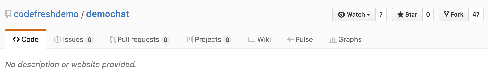

* [Getting started with Docker](#docker)
* [Getting started with DockerCompose](#docker_compose)
* [Getting started with Codefresh YAML](#codefresh_yml)

<a name="docker"/>
#Getting started with Docker

##Add a service
Now enter Codefresh and add your let’s chat app as a codefresh service.

press on ___Add New Service___

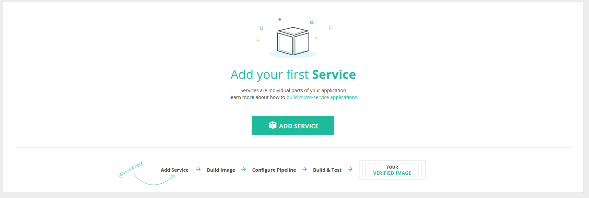

now add you forked demochat repo.
toggle to ___Add by URL___

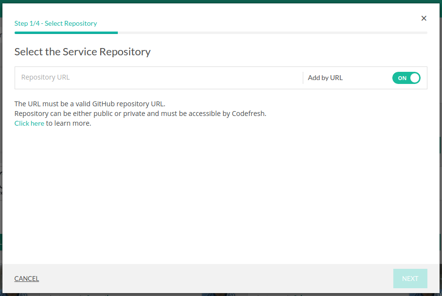

enter the forked repo url

and choose the branch for your first build (in this case ```master```)


when you finish press ___next___.

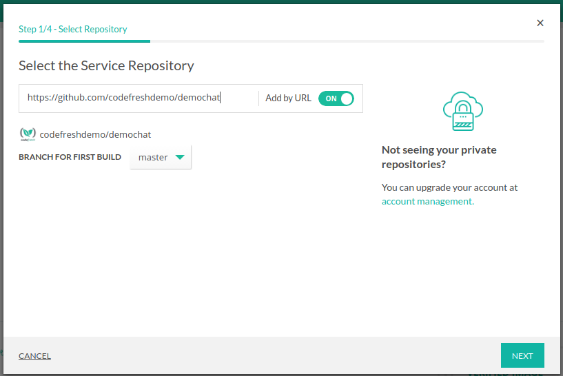

select the build method Dockerfile

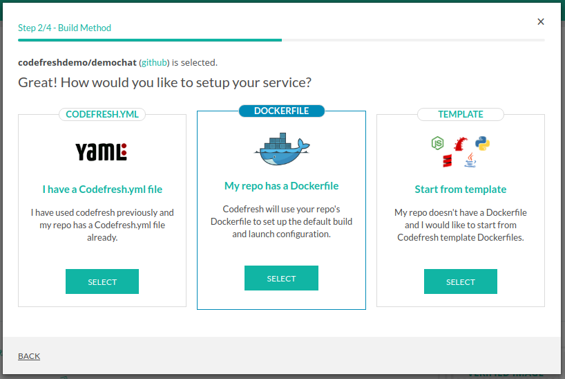

enter the path of your docker file (in our case it's simply ```Dockerfile```)
and press ___next___

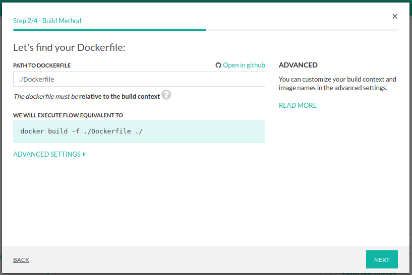

make sure you can see the preview of your dockerfile
and press ___create___

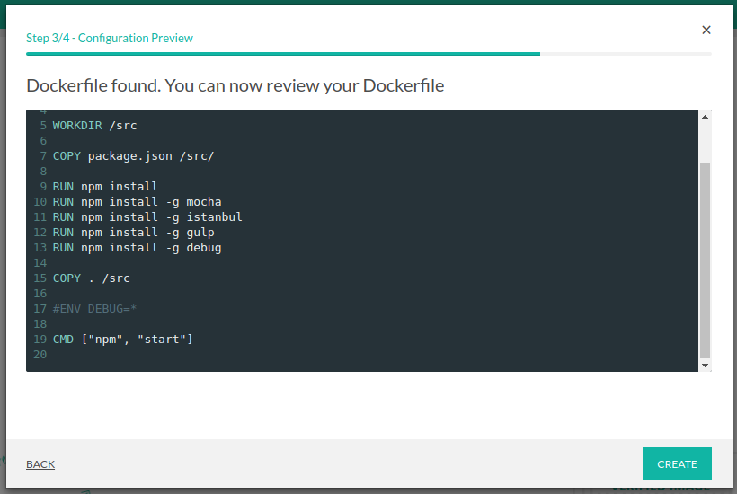

pressing on ___build___  button will trigger a regular build

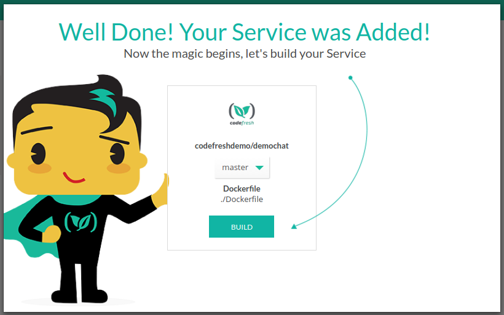

great , you  are running  your build for the first time !

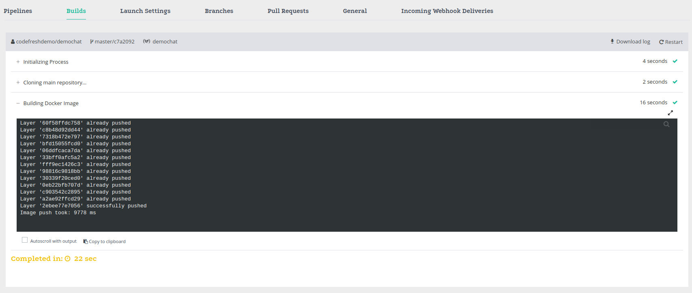

in order to see the list of you current services press on the ___services___ button

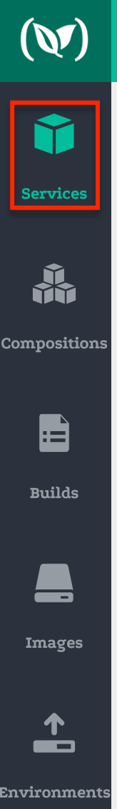

and see your new service

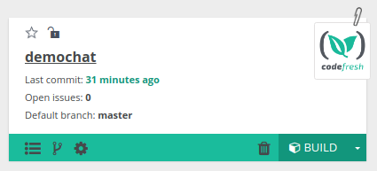

<a name="docker_compose"/>
#Getting started with DockerCompose

Go to the tab "Compositions" and press on the button __ADD COMPOSITION__

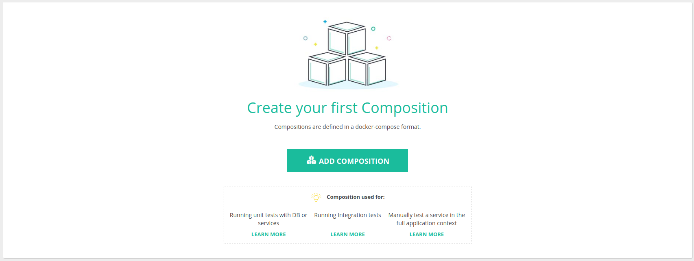

In the **Composition Name** text box, type a name for your composition and click __NEXT__

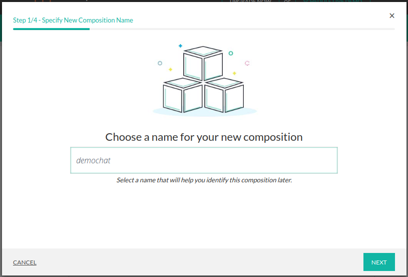

Select Composition Starting Point. On this screen you can choose: __What type of composition would you like to create?__
Select the **File in repo** and click **NEXT**.

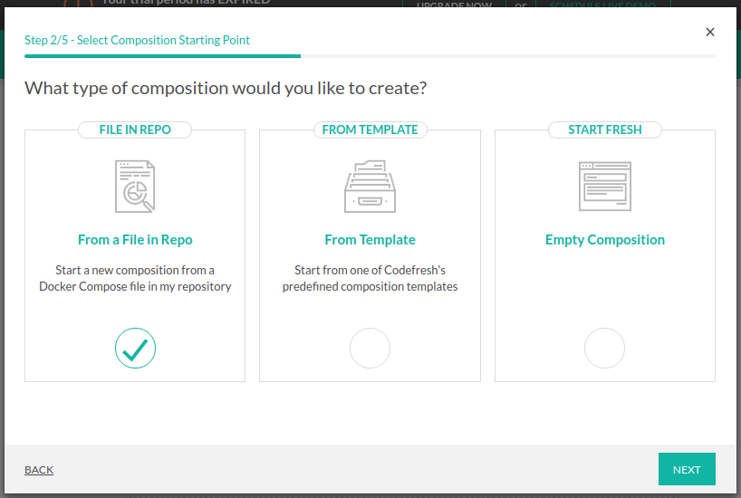

Enter the path https://github.com/codefreshdemo/demochat, choose the branch "master" and click **NEXT**.

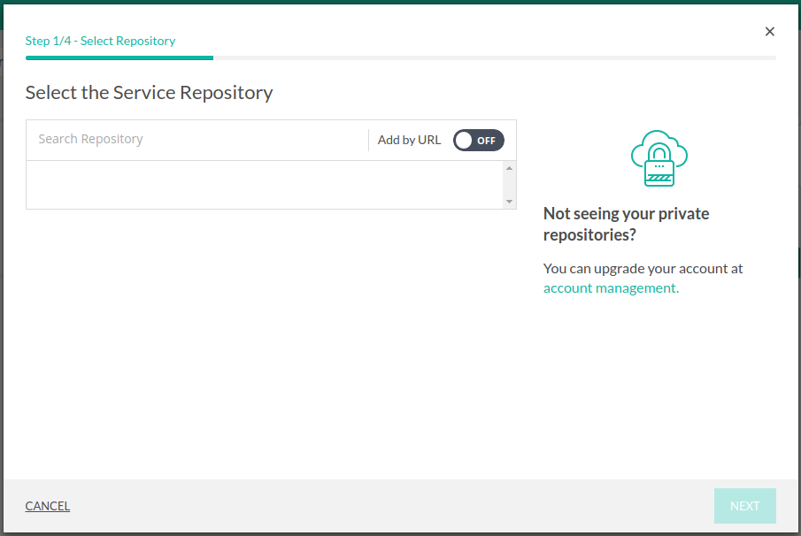

Enter the path of your docker-compose.yml file (in our case it's simply ```docker-compose-build.yml```) and press ___NEXT___

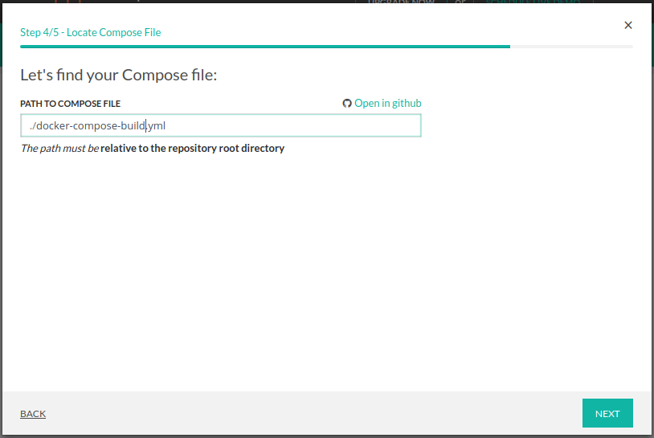

Then click on the **CREATE**.

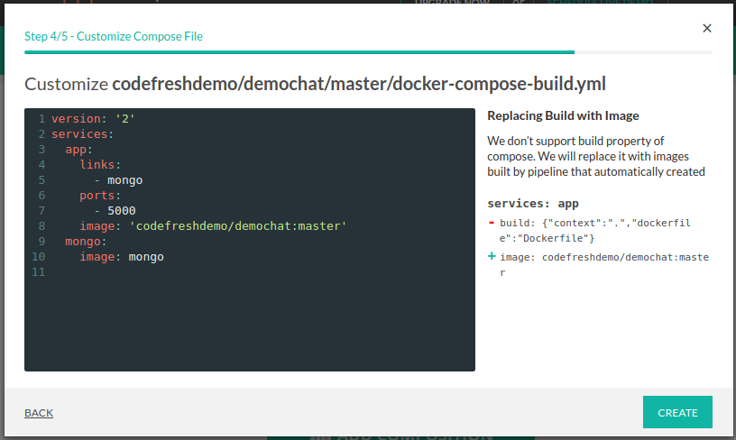

Click on the button __BUILD IMAGES__

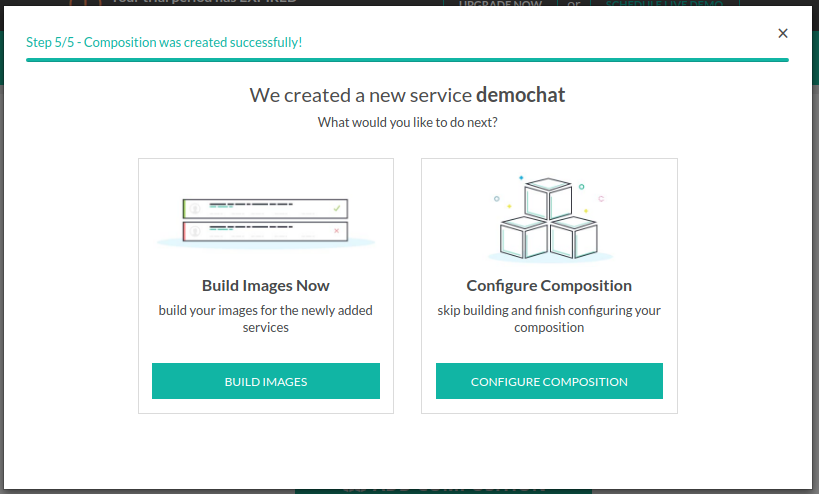

<a name="codefresh_yml"/>
#Getting started with Codefresh YAML


##Add composition
our lets chat app needs a mongo in order to work , so let's make it work

the following composition will use your image at port 500 linked to a mongo image
```
version: '2'
services:
  app:
    image: 'superfresh/lets-chat:master'
    links:
    - mongo
    ports:
      - 5000
  mongo:
    image: mongo
```
you can read more about compositions in our docs :
https://docs.codefresh.io/docs/create-composition

go to codefresh and choose  __compositions__ tab
and press __add new composition__

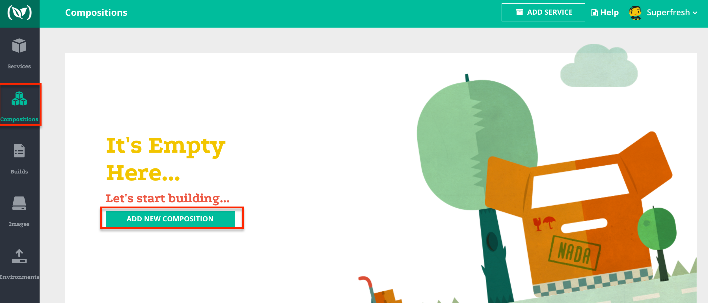


toggele to __advance__ mode , add the composition
and choose a name for it (in this case ```demo-chat-example```)
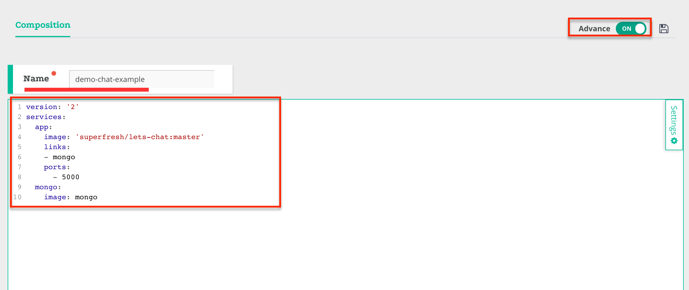

when you finish press on the save icon 
and launch your composition 


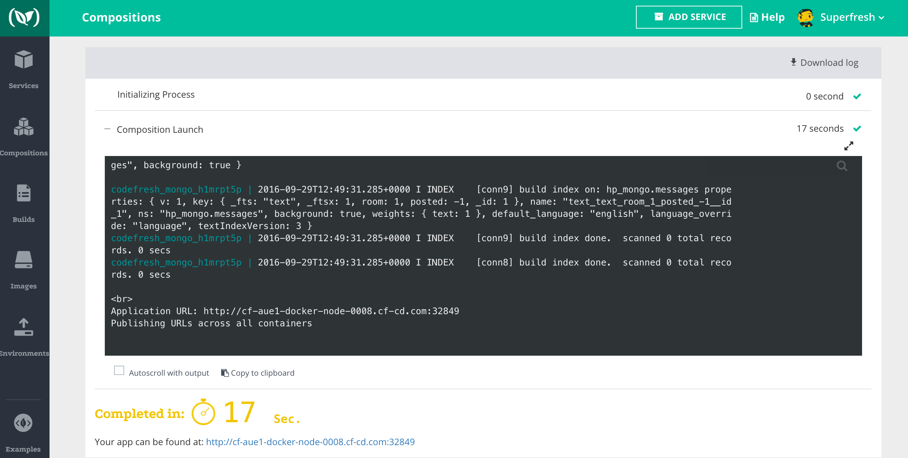

and if you enter the link at the bottom you can see the lets chat app

now add integration test to your YAML file.

##Add composition step
add the following step to your codefresh.yml file


```
composition-step:
      type: composition
      composition: demo-chat-example
      composition-candidates:
        main:
          image: nhoag/curl
          command: bash -c "sleep 20 && curl http://app:5000/" | echo 'works'
```
under ```composition``` you need to put the name of composition from the last step in order to use it
(in this case ```demo-chat-example```)
in this step codefresh will use the ```nhoag/curl``` image that can run this command : ```bash -c "sleep 20 && curl http://app:5000/" | echo 'works'```
which will print "works" if a curl command to your app at port 5000 succeed.

you can read more about composition step in our docs :
 https://docs.codefresh.io/docs/steps

run the build
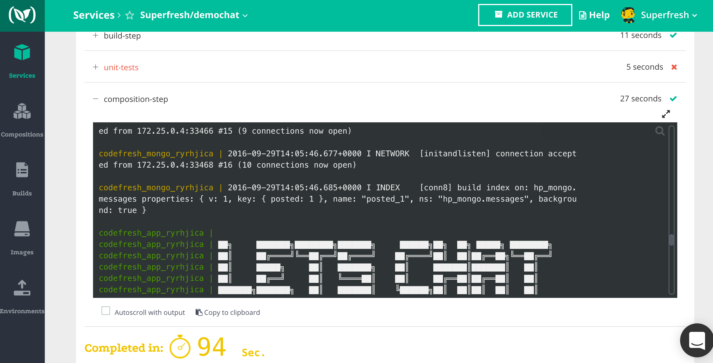
success !


