Use this tutorial to familiarize yourself with codefresh.yml file and codefresh functionality.


This tutorial is based on let’s chat [app].

https://github.com/codefreshdemo/demochat

###Let’s chat is self-hosted chat app for small teams or big

This tutorial will walk you through the process of adding the following :


* Build step - that will build docker image for your let’s chat app

* Push to registry step - that will push your image to docker hub

* Unit Test step - A freestyle step that runs the unit test of the demo chat after the build 

* Composition step - This step will run a composition which use your chat image from the build step, docker image of curl 
and check if your application is responsive. It will do so by printing "works" if a curl command to our app at port 5000 succeed.  

So the first thing you need to do is :

##Fork our repo 
//todo: put both the fork repo optioin and add by url option 

Enter the following link and fork let’s chat app


##Add a service
Now enter Codefresh and add your let’s chat app as a codefresh service.

press on ___Add New Service___

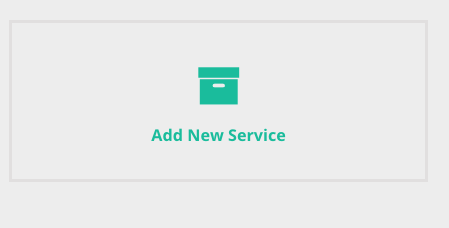

now add our demochat repo.
toggle to ___Add by URL___


enter the repo url : ```https://github.com/codefreshdemo/demochat```

and choose the branch for your first build (in this case ```master```)


when you finish press ___next___.

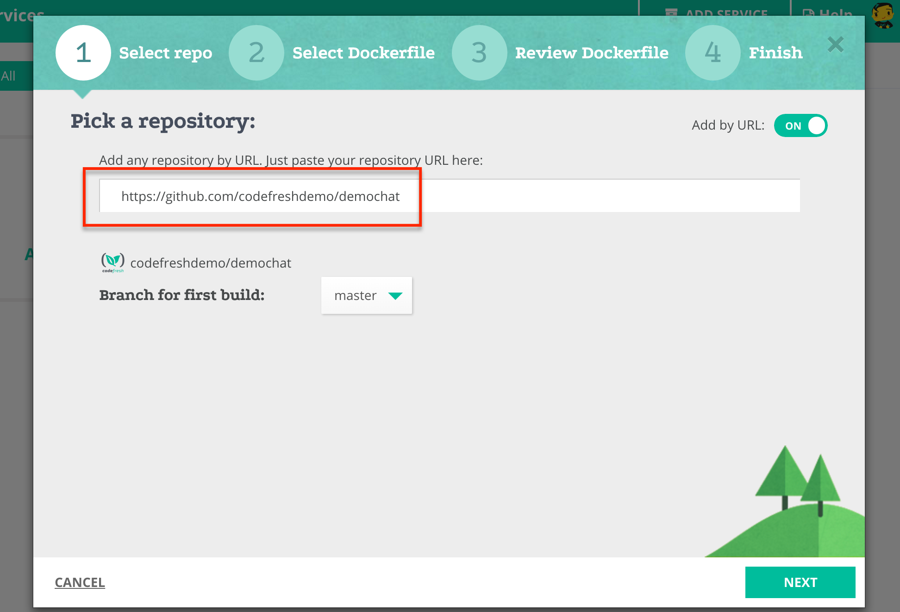

enter the path of your docker file (in our case it's simply ```Dockerfile```)
and press ___next___


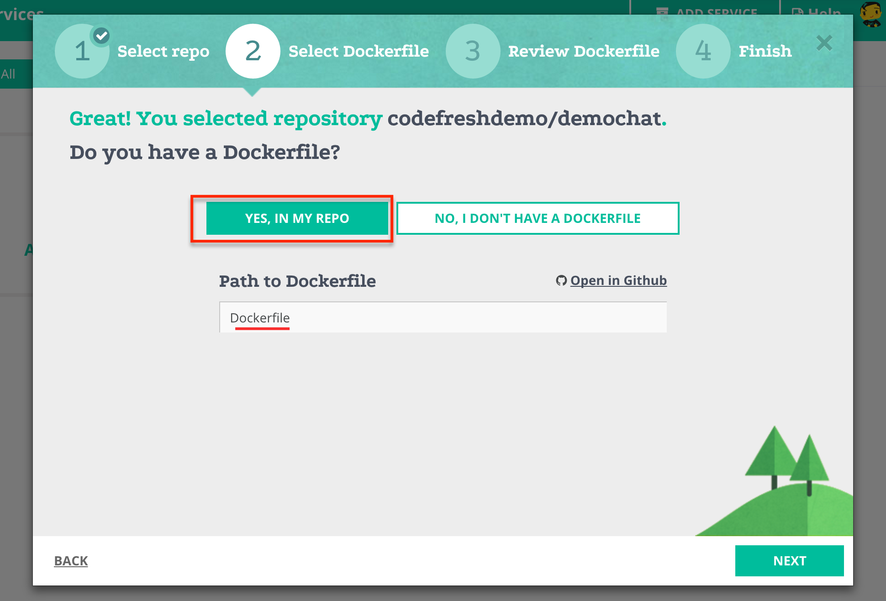

make sure you can see the preview of your dockerfile
and press ___create___
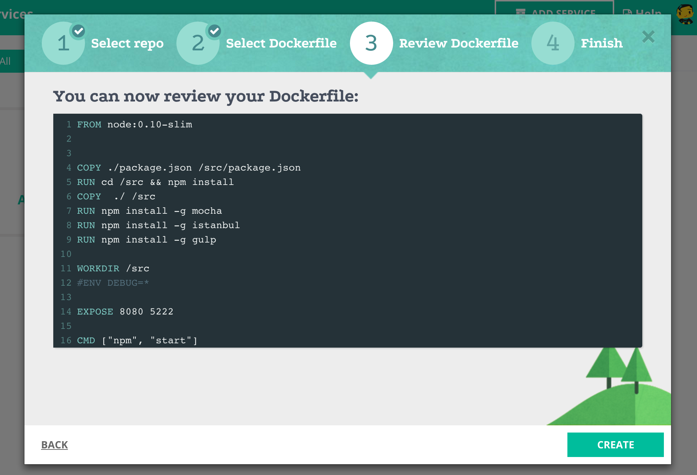

pressing on ___build___  button will trigger a regular build 
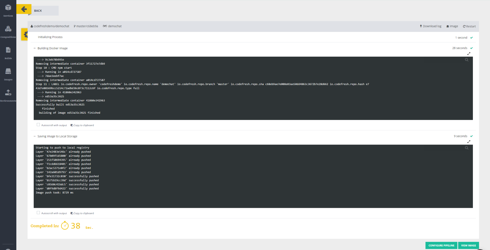

great , you  are running  your build for the first time !

in order to see the list of you current services press on the ___services___ button
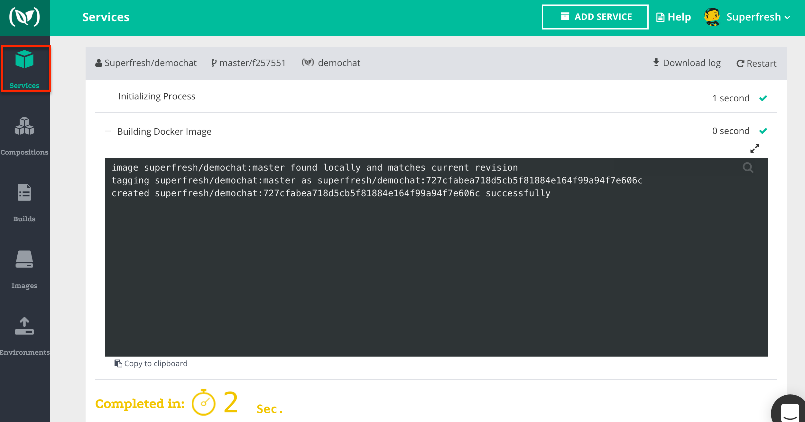


and see your new service

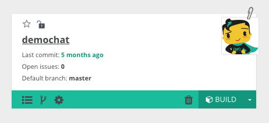


##Build your image
Create a codefresh.yml file using YAML syntax .

The file should be in the following structure
```
version: '1.0'
steps:

    build-step:
        type: build
        dockerfile: Dockerfile
        image-name: superfresh/lets-chat
        tag: codefresh
     
 ```

```build-step``` can be any name that you want    

Under the ```dockerfile``` property write your dockerfile path.

```image-name``` will be the name of your image. The image name is very important for the push step so make sure it suit the repository's conventions (for example: dockerhub require the image name to be in the format of <user name>/<image name> so in our case it would be ```superfresh/lets-chat```)

```tag``` will be the tag of the image

After you finish, add the codefresh.yml file to your repository.

##Configure your service to use codefresh.yml
Go back to codefresh services, and choose your service. 
 
turn on the __USE YML BUILD__ option. 

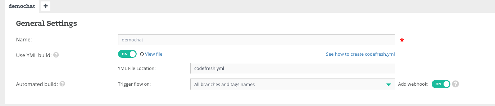
press on __BUILD__ , choose your branch (```master```)
And run the YML build for the first time !
//todo: show how you get to the previous builds and tell the user to build again

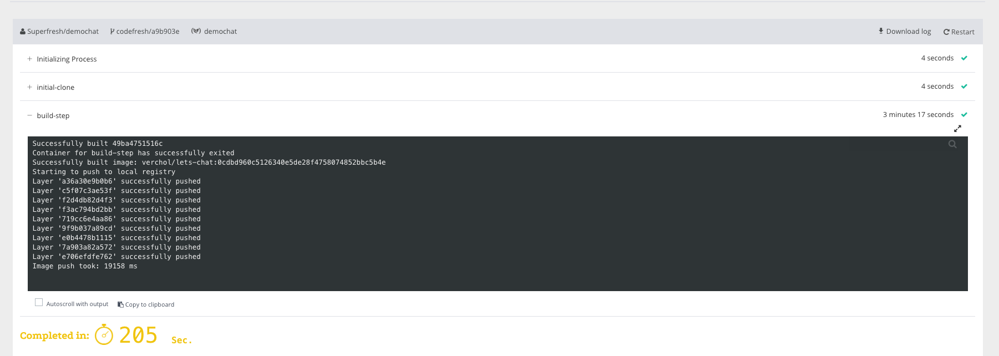

after the build is finished you can find it under the  __BUILDS__ tab by toggling to  __YML Builds__
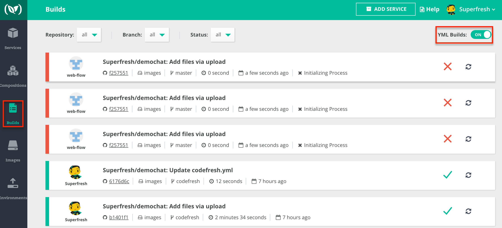

##Push your image to docker registry
First configure your account’s Docker registry details and credentials 
under __account management__
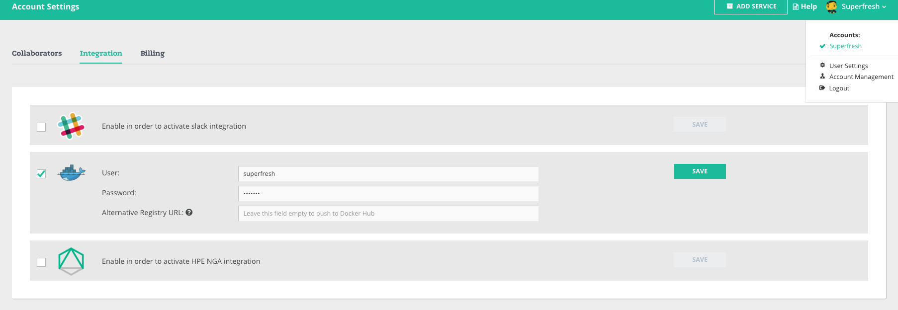
Now add the following step to your codefresh.yml file
```
push to registry:
     type: push
     candidate: ${{build-step}}
     tag: ${{CF_BRANCH}}
```

You can read about 
```${{build-step}}``` and ${{CF_BRANCH}} are codefresh vars which you can use.

* ```${{build-step}}``` - will take the image from the build-step
* ```${{CF_BRANCH}}``` - Is the branch name that is currently being built. In our example it will user the ```master``` tag. 

Notice: you don't have to use the ```CF_BRANCH``` environment variable. You can use whatever tag name you want.
 
Make sure you gave the image a name that you are able to push to your registry (dockerhub in our example).

##Unit test your image
add the following step to your codefresh.yml file
```
unit-tests:
      image: ${{build-step}}
      fail-fast: false
      working-directory : ${{initial-clone}}
      commands:
        - npm test
        - echo $(date)
```        
under ```commands```  you can put whatever commands that you like , ```npm test``` will run the 
test for lets chat app and ```echo $(date)``` will print the date 

##Add composition 
our lets chat app needs a mongo in order to work , so let's make it work

the following composition will use your image at port 500 linked to a mongo image 
```
version: '2'
services:
  app:
    image: 'superfresh/lets-chat:master'
    links:
    - mongo
    ports:
      - 5000
  mongo:
    image: mongo
``` 


go to codefresh and choose  __compositions__ tab
and press __add new composition__ 


 
 
toggele to __advance__ mode , add the composition 
and choose a name for it (in this case ```demo-chat-example```)


when you finish press on the save icon 

##Add composition step
add the following step to your codefresh.yml file


```
composition-step:
      type: composition
      composition: demo-chat-example
      composition-candidates:
        main:
          image: nhoag/curl
          command: bash -c "sleep 20 && curl http://app:5000/" | echo 'works'
```
under ```composition``` you need to put the name of composition from the last step in order to use it
(in this case ```demo-chat-example```)
in this step codefresh will use the ```nhoag/curl``` image that can run this command : ```bash -c "sleep 20 && curl http://app:5000/" | echo 'works'```
which will print "works" if a curl command to your app at port 5000 succeed.


and that's it !

Yaml variables :
${{build-step}} - will take the image from the build-step(or any other build step name)
${{CF_BRANCH}} will use the branch that the builds runs on
${{initial-clone}}  contains the path and files taken from your initial clone step .


[app]: https://github.com/containers101/demochat
